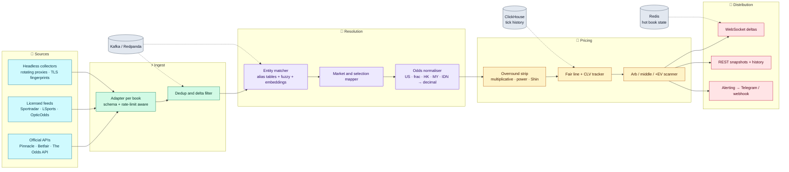

<div align="center">


<a href="#-reach-me">
  
</a>

<br/>


<a href="https://github.com/byteforge9190?tab=followers"></a>


</div>

---

## `whoami`

```jsonc
{
  "role":      "Odds data engineer — aggregation, normalisation, distribution",
  "obsession": "Getting the same market from 40 books to agree on what it is",
  "builds": [
    "bookmaker adapters that survive layout changes and rate limits",
    "event + market + selection matching across incompatible taxonomies",
    "devig / fair-value pricing off sharp reference books",
    "arbitrage, middle and +EV scanners that fire before the line moves",
    "WebSocket fanout that pushes deltas, not snapshots"
  ],
  "cares_about": ["p99 latency", "data lineage", "not getting blocked", "responsible gambling"],
  "status": "open to consulting on odds feeds & pricing infrastructure"
}
```

The hard part of betting data was never the scraping. It's that **Man Utd vs Man City** is `MANU-MANC` at one book, `Manchester United FC – Manchester City FC` at the next, and an opaque numeric ID at a third — and you have three seconds to decide they are the same event before the price goes stale. That is the problem I have spent my career on.

---

## 🏗️ The pipeline I keep rebuilding (and keep making faster)



---

## 🧮 The bit everyone gets wrong: devig before you compare

Two books showing `2.05 / 1.85` and `2.10 / 1.80` are **not** offering the same opinion — they are carrying different margin. Compare fair prices, not posted prices.

```go
// oddsx/fair.go — strip the overround, then look for a real edge.
package oddsx

import "math"

type Quote struct {
	Book  string
	Price []float64 // decimal, one per outcome
}

// impliedSum is the total implied probability once every price is raised to k.
func impliedSum(price []float64, k float64) (s float64) {
	for _, p := range price {
		s += math.Pow(1/p, k)
	}
	return s
}

// Devig removes the bookmaker margin so the outcomes sum to 1.0.
// Power method: solve for k where Σ (1/pᵢ)^k == 1. Closer to reality than
// naive proportional scaling, which systematically over-taxes longshots.
func Devig(price []float64) []float64 {
	lo, hi := 0.5, 1.5
	for i := 0; i < 60; i++ { // bisection — 60 rounds is float64-exact
		if k := (lo + hi) / 2; impliedSum(price, k) > 1 {
			lo = k
		} else {
			hi = k
		}
	}
	k := (lo + hi) / 2
	fair := make([]float64, len(price))
	for i, p := range price {
		fair[i] = math.Pow(1/p, k)
	}
	return fair
}

// Arb returns ROI (percent) and which book to take each leg at. Positive == surebet.
func Arb(quotes []Quote) (roi float64, legs []string) {
	best := make([]float64, len(quotes[0].Price))
	legs = make([]string, len(best))
	for _, q := range quotes {
		for i, p := range q.Price {
			if p > best[i] {
				best[i], legs[i] = p, q.Book
			}
		}
	}
	inv := 0.0
	for _, p := range best {
		inv += 1 / p
	}
	return (1/inv - 1) * 100, legs
}
```

> **Why it matters:** an arb computed on posted odds surfaces hundreds of fake edges a day. One computed against a devigged sharp reference surfaces the handful that are really there — and tells you *which side is wrong*.

---

## 🛠️ Stack

<table>
<tr><td><b>Collection</b></td><td>


</td></tr>

<tr><td><b>Streaming</b></td><td>


</td></tr>

<tr><td><b>Storage</b></td><td>


</td></tr>

<tr><td><b>Modelling</b></td><td>


</td></tr>

<tr><td><b>Delivery</b></td><td>


</td></tr>
</table>

---

## 📚 Domain toolkit

<details>
<summary><b>Odds formats &amp; math</b> — the conversions and corrections that have to be exact</summary>

<br/>

| Concept | What I do with it |
|---|---|
| Decimal · American · Fractional · Hong Kong · Malay · Indonesian | One canonical decimal representation, lossless round-trip, rational-form fractions |
| Overround / vig | Multiplicative, additive, **power** and **Shin** devigging, chosen per market shape |
| Fair value & no-vig line | Sharp-book reference pricing (Pinnacle, exchange) as the truth signal |
| Closing Line Value | Per-bet CLV tracking — the only honest measure of whether a model is real |
| Expected value & Kelly | Fractional Kelly staking with correlation-aware exposure caps |
| Arbitrage · middles · scalps | Stake splitting, rounding to book limits, execution-risk scoring |
| Line movement | Steam detection, limit-weighted moves, market width as a confidence signal |

</details>

<details>
<summary><b>Feeds &amp; integrations</b> — what I have wired up</summary>

<br/>

- **Exchanges:** Betfair Exchange API (Stream + REST), Smarkets, Matchbook — ladder depth, not just top-of-book
- **Sharp books:** Pinnacle and reference-grade pricing, with limit movement treated as a signal in its own right
- **Retail books:** the long tail of regional operators, each with its own taxonomy and none of them with a spec
- **Licensed providers:** Sportradar, Genius Sports, LSports, OpticOdds, The Odds API, BetsAPI
- **Sports:** football, basketball, tennis, baseball, hockey, MMA, esports — including player props and alternate lines
- **Realities:** rate limits, geo-fencing, TLS/JA3 fingerprinting, Cloudflare, and schema drift on a Tuesday with no changelog

</details>

<details>
<summary><b>Matching &amp; normalisation</b> — the unglamorous 80%</summary>

<br/>

- **Event matching:** alias dictionaries → normalised tokens → fuzzy scoring → embedding fallback → human review queue for the last 0.5%
- **Market mapping:** one internal market taxonomy; every book maps into it, never the other way round
- **Selection mapping:** handicaps and totals keyed by *line value*, so `-2.5` at one book never silently pairs with `-3.0` at another
- **Player props:** name disambiguation across roster feeds, injury-driven market suspension
- **Time alignment:** kickoff drift, postponement and the in-play clock — a "live" price on a suspended market is worse than no price at all

</details>

<details>
<summary><b>Running a feed in production</b></summary>

<br/>

- Deltas over snapshots — bandwidth drops by roughly 90% and clients stay in sync
- Per-book health scoring: staleness, error rate, suspension ratio, silent-drift detection
- Backfill and replay from ClickHouse, so a model backtests on *exactly* what the feed saw
- Circuit breakers per adapter — one dead book never takes the pipeline down with it
- Data lineage on every price: which book, which fetch, which parser version

</details>

---

## 📦 Featured work

| Project | What it is | Stack |
|---|---|---|
| **`odds-mesh`** | Multi-book aggregation service — 40+ adapters, unified taxonomy, WebSocket delta stream | Go · Kafka · Redis · ClickHouse |
| **`devigger`** | Overround removal (multiplicative / power / Shin) and fair-line computation | Rust + Python bindings |
| **`matchbook-ai`** | Event and selection resolution across bookmakers: alias tables, fuzzy scoring, embedding fallback | Python · Polars · pgvector |
| **`surebet-radar`** | Arbitrage, middle and +EV scanner with execution-risk scoring and Telegram alerting | Go · NATS · TypeScript |
| **`clv-tracker`** | Closing-line-value analytics — the scoreboard that says whether a model actually works | Python · DuckDB · Next.js |

> Some client work lives in private repos. Happy to walk through the architecture and the trade-offs on a call.

---

## 📊 GitHub

<sub>Panels below are rendered nightly by <a href="./.github/workflows/metrics.yml"><code>metrics.yml</code></a> and committed into this repo — no third-party widget host to go down on me. Fitting, for someone who builds feeds.</sub>

<div align="center">


<picture>
  <source media="(prefers-color-scheme: dark)" srcset="https://streak-stats.demolab.com?user=byteforge9190&hide_border=true&background=0D1117&ring=22D3EE&fire=F59E0B&currStreakLabel=22D3EE&sideLabels=C9D1D9&dates=8B949E&currStreakNum=C9D1D9&sideNums=C9D1D9" />
  
</picture>

</div>

### 🧊 A year of commits, in isometric

<div align="center">
  <picture>
    <source media="(prefers-color-scheme: dark)" srcset="https://raw.githubusercontent.com/byteforge9190/byteforge9190/main/profile-3d-contrib/profile-night-view.svg" />
    
  </picture>
</div>

### 🐍 Watch the contributions get eaten

<div align="center">
  <picture>
    <source media="(prefers-color-scheme: dark)" srcset="https://raw.githubusercontent.com/byteforge9190/byteforge9190/output/snake-dark.svg" />
    
  </picture>
</div>

---

## 🤝 Reach me

<div align="center">

<!-- TODO: swap every REPLACE_ME below for your real handle before pushing -->

<a href="mailto:REPLACE_ME@example.com"></a>
<a href="https://t.me/REPLACE_ME"></a>
<a href="https://www.linkedin.com/in/REPLACE_ME"></a>
<a href="https://discord.com/users/REPLACE_ME"></a>
<a href="https://x.com/REPLACE_ME"></a>
<a href="https://REPLACE_ME.dev"></a>

<br/><br/>

**Good conversations to have with me:**<br/>
*"our feed goes stale during in-play"* · *"we cannot match events across books"* · *"our arb alerts are 95% false positives"* · *"we need tick history we can actually backtest on"*

<br/>

<sub>🔞 I build tooling for licensed operators, traders and researchers. Gamble responsibly — <a href="https://www.begambleaware.org/">BeGambleAware</a> · <a href="https://www.gamblingtherapy.org/">Gambling Therapy</a></sub>

</div>


