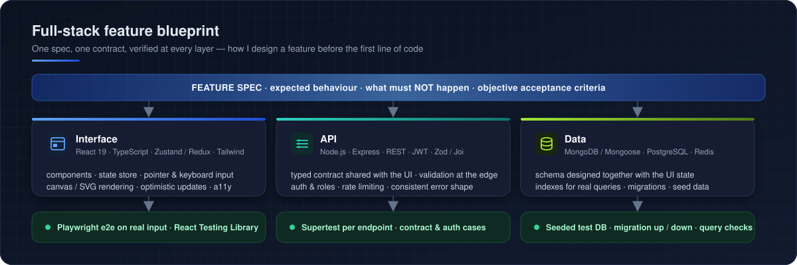

<div align="center">


<a href="#-featured">
  
</a>

<br/>


</div>

---

## 👋 Hi, I'm Byte Forge

Full-stack engineer based in Madrid, strongest on the frontend. I design and build complete features end to end — the React + TypeScript interface, the Node/Express API behind it, the MongoDB or PostgreSQL schema underneath — and I care as much about *proving* a feature behaves correctly as about shipping it.

The work I enjoy most sits where product design meets engineering: editors, dashboards, drag-and-drop, interfaces that draw on a `<canvas>` or SVG, and the state management that keeps them consistent under rapid input.

<div align="center">

| | |
|---|---|
| 🎨 **Frontend & UI** | React 19, TypeScript, Vite, Zustand / Redux Toolkit, TanStack Query, Tailwind, Canvas 2D, SVG |
| ⚙️ **Backend** | Node.js, Express, REST API design, JWT auth, validation (Zod / Joi), rate limiting |
| 🗄️ **Data** | MongoDB + Mongoose, PostgreSQL, Redis |
| 🧪 **Verification** | Playwright, Vitest, Jest, React Testing Library, specs with objective pass / fail criteria |
| 🚀 **Ship** | Docker, GitHub Actions, Vercel / Netlify / Render |

</div>

<div align="center">
  
</div>

---

## 📌 Featured

### [`canvas-task-alignment`](https://github.com/byteforge9190/canvas-task-alignment) — a task spec, its tests, and the reference build

A worked example of how I specify, build and grade frontend work. A React / TypeScript canvas editor, a three-step task written from screenshots of the finished feature, and a test suite that decides *pass* or *fail* without judgement calls.

<a href="https://github.com/byteforge9190/canvas-task-alignment/blob/main/TASK.md">
  
</a>

| | |
|---|---|
| **The task** | `TASK.md`: marquee selection → align / distribute toolbar → keyboard nudge with undo. Precise state contract, worked numeric examples, documented traps (floating-point drift, edge-contact hit-testing). |
| **Success criteria** | 12 unit tests on the geometry + 16 Playwright tests that drive the real UI with pointer and keyboard events and assert on application state, not pixels. |
| **Review process** | `VERIFICATION.md`: a ten-minute reviewer procedure with integrity checks and explicit accept / reject rules. |
| **Branches** | `main` = the starter an implementer receives (tests fail by design) · `solution` = reference implementation (all green) |

```bash
git clone https://github.com/byteforge9190/canvas-task-alignment && cd canvas-task-alignment
npm ci && npx playwright install chromium
git checkout solution && npm test        # 12 unit + 16 e2e pass
git diff main solution --stat            # exactly what the task asks for
```

<!-- Next featured entries go here as they land. Only link work that is actually mine. -->

---

## 🧭 How I work



> "It looks right" is where the work starts, not where it ends.

- **Design the whole feature, not one layer.** Schema, API contract and UI state are decided together, so the interface never has to paper over a bad data model.
- **Write the expected behaviour down before coding** — including what should *not* happen (no history entry on a marquee, no nudge with an empty selection).
- **Prefer tests that assert on state** over screenshots; keep the few pixel checks explicit and manual.
- **Treat ambiguity as a defect in the spec.** If two reasonable implementations would disagree, fix the spec — don't grade the guess.
- **Document the traps** instead of letting people fall into them.

---

## 🤝 Reach me

<div align="center">

<a href="https://github.com/byteforge9190/canvas-task-alignment/issues"></a>

<br/><br/>
<sub>Open to remote full-stack / frontend engineering work and contract task-design roles. The quickest way to reach me is an issue or discussion on any of my repos.</sub>

</div>


